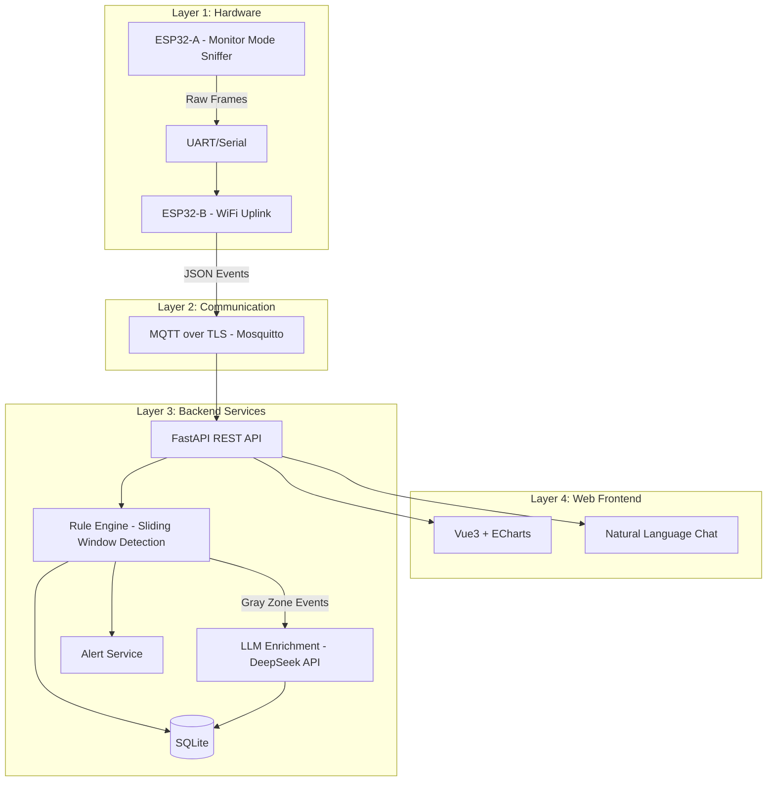

# WiFi Deauth Sentinel

基于 ESP32 与大语言模型的 WiFi 去认证攻击智能感知系统

ESP32 嗅探 WiFi Deauth 攻击帧，规则引擎做实时检测，LLM 提供可解释归因、安全报告和自然语言交互——轻量 IoT 攻击检测系统 + AI 可解释安全助手。

## 系统架构



## 技术栈

| Layer | Technology |
|-------|-----------|
| Firmware | ESP-IDF / Arduino + WiFi Promiscuous Mode API |
| Communication | MQTT over TLS (Mosquitto) |
| Backend | Python FastAPI + SQLite + DeepSeek API |
| Frontend | Vue3 + ECharts + Chat Component |
| Deployment | Docker Compose |

## 快速开始

### Prerequisites

- Docker & Docker Compose
- ESP32 开发板 ×2
- USB 数据线

### 启动后端服务

```bash
git clone https://github.com/YOUR_USERNAME/wifi-deauth-sentinel.git
cd wifi-deauth-sentinel

# Copy environment variables
cp .env.example .env
# Edit .env with your DeepSeek API key

# Start all services
docker-compose up -d
```

### 固件烧录

See [firmware/README.md](firmware/README.md) for flashing instructions.

## 项目结构

```
wifi-deauth-sentinel/
├── firmware/          # ESP32 firmware (ESP-IDF / Arduino)
├── backend/           # Python FastAPI backend
├── frontend/          # Vue3 web frontend
├── docs/              # Documentation
├── scripts/           # Helper scripts
├── docker-compose.yml # One-click deployment
└── .github/workflows/ # CI
```

## Core Metrics

1. **Detection Latency** — Time from attack to alert
2. **False Positive Rate** — Normal roaming misidentified as attack
3. **False Negative Rate** — Real attacks missed
4. **LLM Attribution Accuracy** — LLM judgment accuracy vs rule engine baseline

## License

[MIT](LICENSE)
